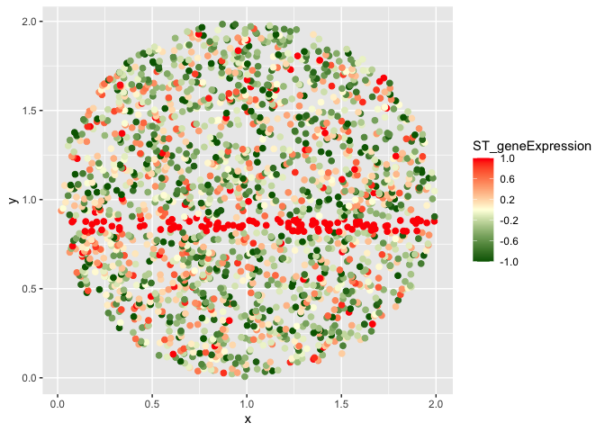

cSVG Simulation
================

## simulating dataset with within gene-group correlation structure Compound symmetry(CS)

``` r
source("Simulate_data.R")
iter=1
set.seed(iter)
cov_st1="CS" #change it to "AR1" to see the result for AR(1) correlation structure
ans=fn_simulation_input1(n=2000,m=10,r=0.9,domain_effect=0,tau=0.2,tau1=0.5,tau2=0.5,tau3=0.5,tau4=1,sig_sq=0.25,kern_para=5,mean_exp=0.05,cov_st=cov_st1)
data_mat=ans$data_mat
coord_df=ans$loc_mat
saveRDS(ans, file = paste0("simulated_datasets/simulated_dataset_",iter,".RData"))
dim(data_mat)
```

    ## [1]   53 2000

``` r
dim(coord_df)
```

    ## [1] 2000    2

``` r
gene_names=rownames(data_mat)
print(gene_names)
```

    ##  [1] "indept1"      "indept2"      "indept3"      "indept4"      "indept5"     
    ##  [6] "indept6"      "indept7"      "indept8"      "indept9"      "indept10"    
    ## [11] "correlated1"  "correlated2"  "correlated3"  "correlated4"  "correlated5" 
    ## [16] "correlated6"  "correlated7"  "correlated8"  "correlated9"  "correlated10"
    ## [21] "spatial1_1"   "spatial1_2"   "spatial1_3"   "spatial1_4"   "spatial1_5"  
    ## [26] "spatial1_6"   "spatial1_7"   "spatial1_8"   "spatial1_9"   "spatial1_10" 
    ## [31] "spatial2_1"   "spatial2_2"   "spatial2_3"   "spatial2_4"   "spatial2_5"  
    ## [36] "spatial2_6"   "spatial2_7"   "spatial2_8"   "spatial2_9"   "spatial2_10" 
    ## [41] "spatial3_1"   "spatial3_2"   "spatial3_3"   "spatial3_4"   "spatial3_5"  
    ## [46] "spatial3_6"   "spatial3_7"   "spatial3_8"   "spatial3_9"   "spatial3_10" 
    ## [51] "unique_1"     "unique_2"     "unique_3"

## Visualizing some of the genes

``` r
#ans=readRDS(paste0("simulated_datasets/simulated_dataset_",iter,".RData"))
g=50 #gene index number
gene=data_mat[g,]

gene_sc=(unlist(gene)-mean(unlist(gene)))/(sd(unlist(gene))) #standardizing the gene expression values
gene_sc[gene_sc>1]=1
gene_sc[gene_sc<(-1)]=-1
df1=data.frame(x=coord_df[,1],y=coord_df[,2],ST_geneExpression=gene_sc)
library(ggplot2)
```

    ## 
    ## Attaching package: 'ggplot2'

    ## The following object is masked from 'package:kernlab':
    ## 
    ##     alpha

``` r
ggplot(df1, aes(x = x, y = y, colour = ST_geneExpression)) +
  geom_point(size=2)+
  scale_colour_gradient2(low="dark green", mid="light yellow",high="Red", midpoint = 0,breaks=seq(-1,1,0.4), limits=c(-1, 1))
```

<!-- -->

``` r
g=52 #gene index number
gene=data_mat[g,]

gene_sc=(unlist(gene)-mean(unlist(gene)))/(sd(unlist(gene))) #standardizing the gene expression values
gene_sc[gene_sc>1]=1
gene_sc[gene_sc<(-1)]=-1
df1=data.frame(x=coord_df[,1],y=coord_df[,2],ST_geneExpression=gene_sc)
library(ggplot2)
ggplot(df1, aes(x = x, y = y, colour = ST_geneExpression)) +
  geom_point(size=2)+
  scale_colour_gradient2(low="dark green", mid="light yellow",high="Red", midpoint = 0,breaks=seq(-1,1,0.4), limits=c(-1, 1))
```

<!-- -->

## Visualizing the correlation structure of the dataset

``` r
library(pheatmap)
library(scales)
annotation <- data.frame(Gene_Type = c(rep(c("Independent","Correlated","Pattern1","Pattern2","Pattern3"),each=10),c("Pattern4","Pattern5","Pattern6")))
      rownames(annotation) <- colnames(t(data_mat))
c1=hue_pal()(8)
pheatmap(cor(t(data_mat)),cluster_rows = FALSE,cluster_cols = FALSE,show_rownames = FALSE, show_colnames = FALSE,annotation=annotation,annotation_names_row = FALSE, annotation_names_col = FALSE,fontsize=15,annotation_colors=list(Gene_Type = c("Independent"= c1[1], "Correlated" = c1[2],"Pattern1"=c1[3],"Pattern2"=c1[4],"Pattern3"=c1[5],"Pattern4"=c1[6],"Pattern5"=c1[7],"Pattern6"=c1[8])))
```

<!-- -->

## Performing step 1 of cSVG on the dataset

``` r
source("fn_main_par.R")
final1=fn_cSVG_par(data_mat=data_mat,loc_mat=coord_df,method_step1="MargcorTest",thres_step1="standard",control=FALSE,ncores=7)
```

    ## [1] "dim of data matrix is:"
    ## [1]   53 2000
    ## [1] "dim of coordinate matrix is:"
    ## [1] 2000    2

``` r
p_adj1=p.adjust(final1[,11], method = "BY")
cSVG_SVG=which(p_adj1<0.05)
write.csv(final1,paste0("Simulation_Results/cSVG_step1_",cov_st1,"_",iter,".csv"))
```

## Looking at the adjusted p-values for the genes.

``` r
#final1=read.csv(paste0("Simulation_Results/cSVG_step1_",cov_st1,"_",iter,".csv"),row.names = 1)
head(final1)
```

    ##              GSP1      COS1      GSP2      COS2      GSP3      COS3       GSP4
    ## indept1 0.3853692 0.3853692 0.2623575 0.2623575 0.2306953 0.2306953 0.01248289
    ## indept2 0.4768299 0.4768299 0.5419279 0.5419279 0.4162117 0.4162117 0.36639707
    ## indept3 0.5343640 0.5343640 0.5445446 0.5445446 0.3164077 0.3164077 0.34995268
    ## indept4 0.5909709 0.5909709 0.4658654 0.4658654 0.3547998 0.3547998 0.66661698
    ## indept5 0.5190864 0.5190864 0.5327161 0.5327161 0.8275575 0.8275575 0.92095949
    ## indept6 0.4815411 0.4815411 0.5255844 0.5255844 0.2386108 0.2386108 0.18490179
    ##               COS4        GSP5        COS5   combined
    ## indept1 0.01248289 0.007746185 0.007746185 0.02302501
    ## indept2 0.36639707 0.668335610 0.668335610 0.49542966
    ## indept3 0.34995268 0.791993146 0.791993146 0.52509184
    ## indept4 0.66661698 0.771474702 0.771474702 0.58793831
    ## indept5 0.92095949 0.637149979 0.637149979 0.78469018
    ## indept6 0.18490179 0.298061678 0.298061678 0.31381837

``` r
p_adj1=p.adjust(final1[,11], method = "BY")
cSVG_SVG=which(p_adj1<0.05)
plot(1:dim(final1)[1],-log10(p_adj1),xlab="Gene_index",ylab="-log10(p_value)",col=c(rep(c1[1:5],each=10),c1[6:8]),pch=15) 
legend("topleft",c("Independent","Correlated","Pattern1","Pattern2","Pattern3","Pattern4","Pattern5","Pattern6"),fill=c1[1:8])
```

<!-- -->

## Performing step 2 of cSVG on the dataset

``` r
source("fn_main_par.R")
final1=fn_cSVG_par(data_mat=data_mat[cSVG_SVG,],loc_mat=coord_df,method_step1="MargcorTest",thres_step1="standard",control=TRUE,ncores=7)
```

    ## [1] "dim of data matrix is:"
    ## [1]   22 2000
    ## [1] "dim of coordinate matrix is:"
    ## [1] 2000    2

``` r
write.csv(final1$final,paste0("Simulation_Results/cSVG_step2_",cov_st1,"_",iter,".csv"))
list_g=final1$list_g
mat=matrix(0,nrow=length(list_g),ncol=1)
for(i in 1:length(list_g)){
    mat[i,]=paste(list_g[[i]],collapse=",")
}
write.csv(mat,paste0("Simulation_Results/cSVG_list_g_",cov_st1,"_",iter,".csv"))
```

## Final step: Clustering SVGs based on step 2 result

``` r
data11=read.csv(paste0("Simulation_Results/cSVG_step1_",cov_st1,"_",iter,".csv"),row.names = 1)
p_adj=p.adjust(data11[,11], method = "BY")
SE_genes=rownames(data11)[which(p_adj<0.05)]

data21=read.csv(paste0("Simulation_Results/cSVG_step2_",cov_st1,"_",iter,".csv"),row.names = 1)
p_adj=p.adjust(data21[,11], method = "BY")
DEC_genes=rownames(data21)[which(p_adj<0.05)]

library(igraph)
```

    ## 
    ## Attaching package: 'igraph'

    ## The following objects are masked from 'package:stats':
    ## 
    ##     decompose, spectrum

    ## The following object is masked from 'package:base':
    ## 
    ##     union

``` r
list1=read.csv(paste0("Simulation_Results/cSVG_list_g_",cov_st1,"_",iter,".csv"))

source("gene_cluster.R")
out1=fn_cluster_genes(SE_genes,list1,DEC_genes)
write.csv(out1,paste0("Simulation_Results/Spclusters_",cov_st1,"_",iter,".csv"))
print(out1)
```

    ##  spatial1_7  spatial1_8  spatial1_9 spatial1_10  spatial2_5  spatial2_6 
    ##           1           1           1           1           2           2 
    ##  spatial2_7  spatial2_8  spatial2_9 spatial2_10  spatial3_3  spatial3_2 
    ##           2           2           2           2           3           3 
    ##  spatial3_4  spatial3_5  spatial3_6  spatial3_7  spatial3_8  spatial3_9 
    ##           3           3           3           3           3           3 
    ## spatial3_10    unique_1    unique_2    unique_3 
    ##           3           4           5           6

## Calculate the ARI for the predicted SVG labels

``` r
library(mclust)
genes_label=c(rep(c("indept","correlated","pattern1","pattern2","pattern3"),each=10),paste0("unique_",1:3))
genes=rownames(data11)
cl1=read.csv(paste0("Simulation_Results/Spclusters_",cov_st1,"_",iter,".csv"))
true_label=genes_label[which(genes %in% cl1[,1])]
ARI=adjustedRandIndex(cl1[,2],true_label)
print(ARI)
```

    ## [1] 1

## Calculate False discovery rates for the result

``` r
#A False discovery occurs when any gene from Indept or correlated gene group shows up in the detected SVG list
cl1=read.csv(paste0("Simulation_Results/Spclusters_",cov_st1,"_",iter,".csv"))
true_label=genes_label[which(genes %in% cl1[,1])]
tab=table(true_label)
print(table(true_label))
```

    ## true_label
    ## pattern1 pattern2 pattern3 unique_1 unique_2 unique_3 
    ##        4        6        9        1        1        1

``` r
FDR1=ifelse("correlated" %in% names(tab),tab[which(names(tab)=="correlated")],0) + ifelse("indept" %in% names(tab),tab[which(names(tab)=="indept")],0)
FDR1=FDR1[iter]/length(true_label)
print(FDR1)
```

    ## [1] 0
