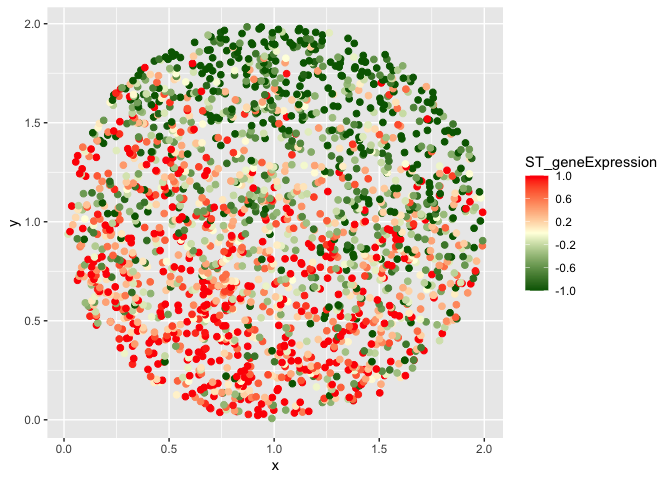
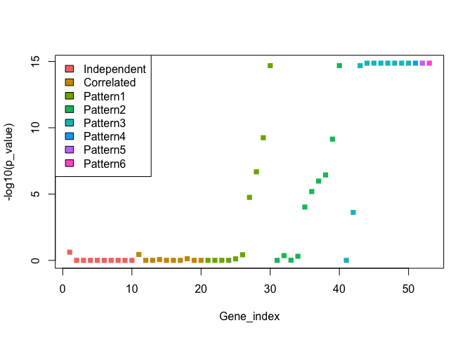

cSVG Simulation
================

## The function to simulate dataset

``` r
fn_simulation_input1<-function(n=2000,m=10,r=0.9,domain_effect=0,tau=0.2,tau1=0.5,tau2=0.1,tau3=0.05,tau4=0.01,sig_sq=0.25,kern_para=5,mean_exp=0,cov_st="CS"){

if(!require(MASS)){
    stop("MASS package not installed")
}else if(!require(Matrix)){
    stop("Matrix package not installed")
}else if(!require(kernlab)){
    stop("kernlab package not installed")
}else {
        if(cov_st=="CS"){
        R1=matrix(r,nrow=m,ncol=m)
        diag(R1)=1
        }else if(cov_st=="AR1") {
          R1<-toeplitz(sapply(1:m,function(i) r^(i-1)))
        }else{
          stop("Select AR1 or CS covariance structure")
        }
        d11=mvrnorm(n,mu=rep(mean_exp,m),Sigma = diag(rep(1,m)), tol = 0)

        sigma=R1+tau1*diag(rep(1,m))
        d1=mvrnorm(n,mu=rep(mean_exp,m),Sigma = sigma, tol = 0) #rows spots, column genes ##only coexpression(no noise)
        
        loc_df=read.csv("/Users/siktadasadhikari/Desktop/cSVG/Simulation/location_2000.csv")
        coord_df=data.frame(loc_df[1:n,2:3])
        coord_df=coord_df[order(coord_df$y),]
        rbf <- rbfdot(sigma = kern_para)
        K=kernelMatrix(kernel=rbf, x=as.matrix(coord_df), y = NULL)
        tau=tau
        K=Matrix::forceSymmetric(K)
        sig_sq=sig_sq
        V=tau*K+sig_sq*diag(1,n)
        sp=mvrnorm(1,mu=rep(mean_exp,n),Sigma = V, tol = 0) 
        co=seq(0.1,1,by=0.1)
        #co=seq(1.1,2,by=0.1)
        sigma1=tau2*diag(rep(1,m))+R1
        d2=mvrnorm(n,mu=rep(mean_exp,m),Sigma =  sigma1, tol = 0) #rows spots, column genes ##only coexpression(no noise)
        for(i in 1:m){
            d2[,i]=d2[,i]+(co[i]*sp)
        }       

        rbf <- rbfdot(sigma = 20)
        K=kernelMatrix(kernel=rbf, x=as.matrix(coord_df), y = NULL)
        tau=tau
        K=Matrix::forceSymmetric(K)
        sig_sq=sig_sq
        V=tau*K+sig_sq*diag(1,n)
        sp=mvrnorm(1,mu=rep(mean_exp,n),Sigma = V, tol = 0) 
        co=seq(0.1,1,by=0.1)
        sigma1=tau3*diag(rep(1,m))+R1
        d3=mvrnorm(n,mu=rep(mean_exp,m),Sigma =  sigma1, tol = 0) #rows spots, column genes ##only coexpression(no noise)
        for(i in 1:m){
            d3[,i]=d3[,i]+(co[i]*sp)
        }

        K=kernelMatrix(kernel=polydot(degree=2), x=as.matrix(coord_df), y = NULL)
        tau=tau
        K=Matrix::forceSymmetric(K)
        sig_sq=sig_sq
        V=tau*K+sig_sq*diag(1,n)
        sp=mvrnorm(1,mu=rep(mean_exp,n),Sigma = V, tol = 0) 
        co=seq(0.1,1,by=0.1)
        sigma1=tau4*diag(rep(1,m))+R1
        d4=mvrnorm(n,mu=rep(mean_exp,m),Sigma =  sigma1, tol = 0) #rows spots, column genes ##only coexpression(no noise)
        for(i in 1:m){
            d4[,i]=d4[,i]+(co[i]*sp)
        }
        d5=mvrnorm(n,mu=rep(0.05,3),Sigma = diag(rep(0.1,3)), tol = 0)
        d5[,1]=d5[,1]+c(rep(0,(10*n/20)),rep(2,(n/20)),rep(0,(9*n/20)))
        d5[,2]=d5[,2]+c(rep(0,(8*n/20)),rep(2,(n/20)),rep(0,(11*n/20)))
        d5[,3]=d5[,3]+c(rep(0,(12*n/20)),rep(2,(n/20)),rep(0,(7*n/20)))
        
        d=cbind(d11,d1,d2,d3,d4,d5)

    genes=paste0("indept",1:(5*m+3))
    genes[(m+1):(2*m)]=paste0("correlated",1:m)
    genes[(2*m+1):(3*m)]=paste0("spatial1_",1:m)
    genes[(3*m+1):(4*m)]=paste0("spatial2_",1:m)
    genes[(4*m+1):(5*m)]=paste0("spatial3_",1:m)
    genes[(5*m+1):(5*m+3)]=paste0("unique_",1:3)

    colnames(d)<-genes
    return(list(data_mat=t(d),loc_mat=as.matrix(coord_df)))
}
}
```

## simulating dataset with within gene-group correlation structure Compound symmetry(CS)

``` r
iter=1
set.seed(iter)
cov_st1="CS" #change it to "AR1" to see the result for AR(1) correlation structure
ans=fn_simulation_input1(n=2000,m=10,r=0.9,domain_effect=0,tau=0.2,tau1=0.5,tau2=0.5,tau3=0.5,tau4=1,sig_sq=0.25,kern_para=5,mean_exp=0.05,cov_st=cov_st1)
```

    ## Loading required package: MASS

    ## Loading required package: Matrix

    ## Loading required package: kernlab

``` r
data_mat=ans$data_mat
coord_df=ans$loc_mat
saveRDS(ans, file = paste0("/Users/siktadasadhikari/Desktop/cSVG/simulated_datasets/simulated_dataset_",iter,".RData"))
dim(data_mat)
```

    ## [1]   53 2000

``` r
dim(coord_df)
```

    ## [1] 2000    2

``` r
gene_names=rownames(data_mat)
print(gene_names)
```

    ##  [1] "indept1"      "indept2"      "indept3"      "indept4"      "indept5"     
    ##  [6] "indept6"      "indept7"      "indept8"      "indept9"      "indept10"    
    ## [11] "correlated1"  "correlated2"  "correlated3"  "correlated4"  "correlated5" 
    ## [16] "correlated6"  "correlated7"  "correlated8"  "correlated9"  "correlated10"
    ## [21] "spatial1_1"   "spatial1_2"   "spatial1_3"   "spatial1_4"   "spatial1_5"  
    ## [26] "spatial1_6"   "spatial1_7"   "spatial1_8"   "spatial1_9"   "spatial1_10" 
    ## [31] "spatial2_1"   "spatial2_2"   "spatial2_3"   "spatial2_4"   "spatial2_5"  
    ## [36] "spatial2_6"   "spatial2_7"   "spatial2_8"   "spatial2_9"   "spatial2_10" 
    ## [41] "spatial3_1"   "spatial3_2"   "spatial3_3"   "spatial3_4"   "spatial3_5"  
    ## [46] "spatial3_6"   "spatial3_7"   "spatial3_8"   "spatial3_9"   "spatial3_10" 
    ## [51] "unique_1"     "unique_2"     "unique_3"

## Visualizing some of the genes

``` r
#ans=readRDS(paste0("/Users/siktadasadhikari/Desktop/cSVG/simulated_datasets/simulated_dataset_",iter,".RData"))
g=50 #gene index number
gene=data_mat[g,]

gene_sc=(unlist(gene)-mean(unlist(gene)))/(sd(unlist(gene))) #standardizing the gene expression values
gene_sc[gene_sc>1]=1
gene_sc[gene_sc<(-1)]=-1
df1=data.frame(x=coord_df[,1],y=coord_df[,2],ST_geneExpression=gene_sc)
library(ggplot2)
```

    ## 
    ## Attaching package: 'ggplot2'

    ## The following object is masked from 'package:kernlab':
    ## 
    ##     alpha

``` r
ggplot(df1, aes(x = x, y = y, colour = ST_geneExpression)) +
  geom_point(size=2)+
  scale_colour_gradient2(low="dark green", mid="light yellow",high="Red", midpoint = 0,breaks=seq(-1,1,0.4), limits=c(-1, 1))
```

<!-- -->

``` r
library(pheatmap)
library(scales)
annotation <- data.frame(Gene_Type = c(rep(c("Independent","Correlated","Pattern1","Pattern2","Pattern3"),each=10),c("Pattern4","Pattern5","Pattern6")))
      rownames(annotation) <- colnames(t(data_mat))
c1=hue_pal()(8)
pheatmap(cor(t(data_mat)),cluster_rows = FALSE,cluster_cols = FALSE,show_rownames = FALSE, show_colnames = FALSE,annotation=annotation,annotation_names_row = FALSE, annotation_names_col = FALSE,fontsize=15,annotation_colors=list(Gene_Type = c("Independent"= c1[1], "Correlated" = c1[2],"Pattern1"=c1[3],"Pattern2"=c1[4],"Pattern3"=c1[5],"Pattern4"=c1[6],"Pattern5"=c1[7],"Pattern6"=c1[8])))
```

<!-- --> \##
Performing step 1 of cSVG on the dataset

``` r
source("/Users/siktadasadhikari/Desktop/cSVG/fn_main.R")
final1=fn_cSVG(data_mat=data_mat[1:5,],loc_mat=coord_df,method_step1="MargcorTest",thres_step1="standard",spp=FALSE,control=FALSE)
p_adj1=p.adjust(final1[,11], method = "BY")
cSVG_SVG=which(p_adj1<0.05)
write.csv(final1,paste0("/Users/siktadasadhikari/Desktop/cSVG/simulation/Simulation_Results/cSVG_step1_",cov_st1,"_",iter,".csv"))
```

## Looking at the adjusted p-values for the genes.

``` r
final1=read.csv(paste0("/Users/siktadasadhikari/Desktop/cSVG/simulation/Simulation_Results/cSVG_step1_",cov_st1,"_",iter,".csv"),row.names = 1)
head(final1)
```

    ##              GSP1 COS1      GSP2 COS2      GSP3 COS3       GSP4 COS4
    ## indept1 0.3853692    1 0.2623575    1 0.2306953    1 0.01248289    1
    ## indept2 0.4768299    1 0.5419279    1 0.4162117    1 0.36639707    1
    ## indept3 0.5343640    1 0.5445446    1 0.3164077    1 0.34995268    1
    ## indept4 0.5909709    1 0.4658654    1 0.3547998    1 0.66661698    1
    ## indept5 0.5190864    1 0.5327161    1 0.8275575    1 0.92095949    1
    ## indept6 0.4815411    1 0.5255844    1 0.2386108    1 0.18490179    1
    ##                GSP5      COS5  combined
    ## indept1 0.007746185 1.0000000 0.9648157
    ## indept2 0.668335610 1.0000000 0.9800107
    ## indept3 0.791993146 0.9999701 0.9800690
    ## indept4 0.771474702 1.0000000 0.9801957
    ## indept5 0.637149979 0.9999995 0.9807706
    ## indept6 0.298061678 0.9999970 0.9795962

``` r
p_adj1=p.adjust(final1[,11], method = "BY")
cSVG_SVG=which(p_adj1<0.05)
plot(1:dim(final1)[1],-log10(p_adj1),xlab="Gene_index",ylab="-log10(p_value)",col=c(rep(c1[1:5],each=10),c1[6:8]),pch=15) 
legend("topleft",c("Independent","Correlated","Pattern1","Pattern2","Pattern3","Pattern4","Pattern5","Pattern6"),fill=c1[1:8])
```

<!-- -->

## Performing step 2 of cSVG on the dataset

``` r
#source("/Users/siktadasadhikari/Desktop/cSVG/fn_main.R")
final1=fn_cSVG(data_mat=data_mat[cSVG_SVG,],loc_mat=coord_df,method_step1="MargcorTest",thres_step1="standard",spp=FALSE,control=TRUE)
write.csv(final1$final,paste0("/Users/siktadasadhikari/Desktop/cSVG/simulation/Simulation_Results/cSVG_step2_",cov_st1,"_",iter,".csv"))
list_g=final1$list_g
mat=matrix(0,nrow=length(list_g),ncol=1)
for(i in 1:length(list_g)){
    mat[i,]=paste(list_g[[i]],collapse=",")
}
write.csv(mat,paste0("/Users/siktadasadhikari/Desktop/cSVG/simulation/Simulation_Results/cSVG_list_g_",cov_st1,"_",iter,".csv"))
```

\##Final step: Clustering SVGs based on step 2 result

``` r
data11=read.csv(paste0("/Users/siktadasadhikari/Desktop/cSVG/simulation/Simulation_Results/cSVG_step1_",cov_st1,"_",iter,".csv"),row.names = 1)
p_adj=p.adjust(data11[,11], method = "BY")
SE_genes=rownames(data11)[which(p_adj<0.05)]

data21=read.csv(paste0("/Users/siktadasadhikari/Desktop/cSVG/simulation/Simulation_Results/cSVG_step2_",cov_st1,"_",iter,".csv"),row.names = 1)
p_adj=p.adjust(data21[,11], method = "BY")
DEC_genes=rownames(data21)[which(p_adj<0.05)]

library(igraph)
```

    ## 
    ## Attaching package: 'igraph'

    ## The following objects are masked from 'package:stats':
    ## 
    ##     decompose, spectrum

    ## The following object is masked from 'package:base':
    ## 
    ##     union

``` r
list1=read.csv(paste0("/Users/siktadasadhikari/Desktop/cSVG/simulation/Simulation_Results/cSVG_list_g_",cov_st1,"_",iter,".csv"))
final1=cbind(SE_genes,list1)
final=final1[!final1$SE_genes %in% DEC_genes,]
items=strsplit(final$V1,",")
unique_genes=c()
mat_new=matrix(0,nrow=1,ncol=2)
for(g in 1:nrow(final)){
      gene_list=c(final[g,2],unlist(items[g]))
      gene_list=SE_genes[as.numeric(gene_list)]
            if(length(gene_list)==1){
                  unique_genes=c(unique_genes,gene_list)
            }else{
                  mat=t(combn(gene_list, 2))
                  mat_new=rbind(mat_new,mat)
            }
      }
      el=mat_new[-1,]
      library(igraph)
      gr=graph_from_edgelist(el, directed = FALSE)
      com=cluster_leiden(gr,
      objective_function = "modularity",#c("CPM", "modularity"),
      weights = NULL,
      resolution_parameter = 1,
      beta = 0.01,
      initial_membership = NULL,
      n_iterations = 5,
      vertex_weights = NULL
      )
      out1=membership(com) 
      other_genes=DEC_genes[!DEC_genes %in% names(out1)]
      if(length(other_genes)>1){
            clusters=(max(out1)+1):(max(out1)+length(other_genes))
            names(clusters)=other_genes
            out1=c(out1,clusters)
      }
      write.csv(out1,paste0("/Users/siktadasadhikari/Desktop/cSVG/simulation/Simulation_Results/Spclusters_",cov_st1,"_",iter,".csv"))
print(out1)
```

    ##  spatial1_6  spatial1_7  spatial1_8  spatial1_9 spatial1_10  spatial2_6 
    ##           1           1           1           1           1           2 
    ##  spatial2_7  spatial2_8  spatial2_9 spatial2_10  spatial3_3  spatial3_2 
    ##           2           2           2           2           3           3 
    ##  spatial3_4  spatial3_5  spatial3_6  spatial3_7  spatial3_8  spatial3_9 
    ##           3           3           3           3           3           3 
    ## spatial3_10    unique_1    unique_2    unique_3 
    ##           3           4           5           6

## Calculate the AR1

``` r
library(mclust)
genes_label=c(rep(c("indept","correlated","pattern1","pattern2","pattern3"),each=10),paste0("unique_",1:3))
genes=rownames(data11)
cl1=read.csv(paste0("/Users/siktadasadhikari/Desktop/cSVG/simulation/Simulation_Results/Spclusters_",cov_st1,"_",iter,".csv"))
true_label=genes_label[which(genes %in% cl1[,1])]
ARI=adjustedRandIndex(cl1[,2],true_label)
print(ARI)
```

    ## [1] 1
