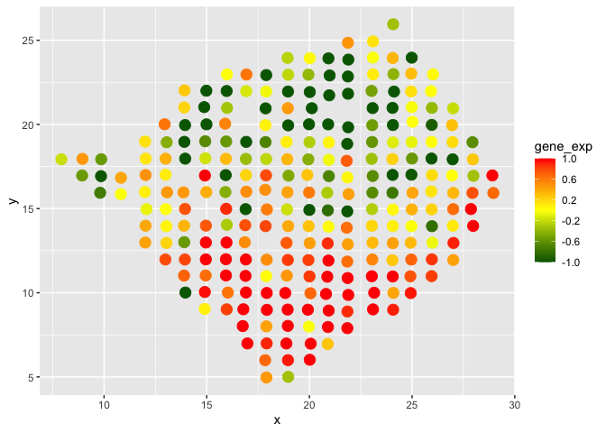
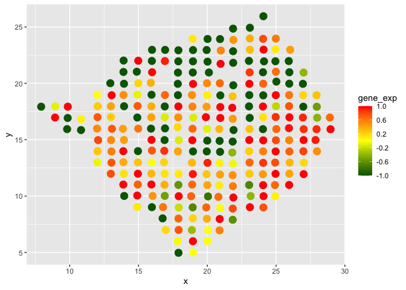
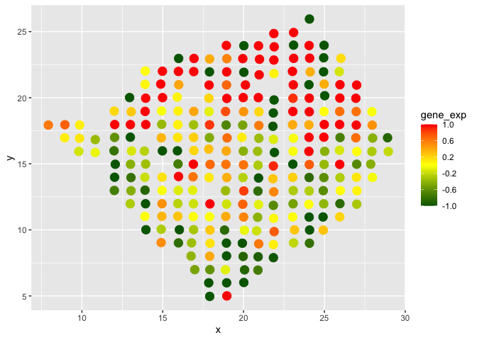
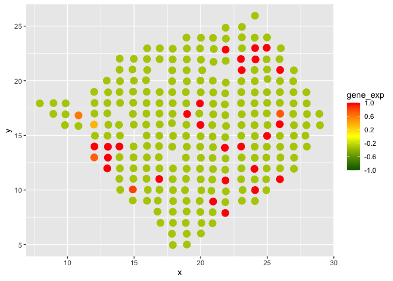

Breast cancer data analysis
================

## Code for analysis by cSVG

``` r
#The dataset was downaloaded from SPARK Github : https://github.com/xzhoulab/SPARK-Analysis/tree/master

library(scuttle)
counts <- read.table("Layer2_BC_count_matrix-1.tsv", check.names = F)
rn <- rownames(counts)
info <- cbind.data.frame(x = as.numeric(sapply(strsplit(rn, split = "x"), 
    "[", 1)), y = as.numeric(sapply(strsplit(rn, split = "x"), "[", 2)))
rownames(info) <- rn

count_df=t(counts)   
loc_df=info[,1:2]

#filtering based on spark criteria
keep_cols=which(apply(count_df,2,sum)>10)
percent=0.1 
keep_rows=which( rowSums(count_df > 0) >= floor(percent*ncol(count_df)) )
count_df=count_df[keep_rows,keep_cols]
loc_df=loc_df[keep_cols,]
dim(count_df) 
```

    ## [1] 5262  250

``` r
dim(loc_df) 
```

    ## [1] 250   2

``` r
#normalizing the data
count_df=as.matrix(count_df)
loc_df=as.matrix(loc_df)
norm_df=scuttle::normalizeCounts(count_df,transform="log")

data_mat=norm_df
loc_mat=loc_df
```

``` r
source("fn_main_par.R")
final1=fn_cSVG_par(data_mat=data_mat,loc_mat=loc_mat,method_step1="MargcorTest",thres_step1="standard",control=FALSE,ncore=7)
```

    ## [1] "dim of data matrix is:"
    ## [1] 5262  250
    ## [1] "dim of coordinate matrix is:"
    ## [1] 250   2

``` r
p_adj1=p.adjust(final1[,11], method = "BY")
cSVG_SVG=which(p_adj1<0.05)
print(length(cSVG_SVG))
```

    ## [1] 724

``` r
write.csv(final1,"result/result_step1.csv")


final1=fn_cSVG_par(data_mat=data_mat[cSVG_SVG,],loc_mat=loc_mat,method_step1="MargcorTest",thres_step1="standard",control=TRUE,ncore=7)
```

    ## [1] "dim of data matrix is:"
    ## [1] 724 250
    ## [1] "dim of coordinate matrix is:"
    ## [1] 250   2

``` r
write.csv(final1$final,"result/result_step2.csv")
list_g=final1$list_g
mat=matrix(0,nrow=length(list_g),ncol=1)
for(i in 1:length(list_g)){
    mat[i,]=paste(list_g[[i]],collapse=",")
}
write.csv(mat,"result/list_step2.csv")
```

``` r
data11=read.csv("result/result_step1.csv")
p_adj=p.adjust(data11[,12], method = "BY")
SE_genes=data11[which(p_adj<0.05),1]

data21=read.csv("result/result_step2.csv")
p_adj=p.adjust(data21[,12], method = "BY")
DEC_genes=data21[which(p_adj<0.05),1]

list1=read.csv("result/list_step2.csv")

source("gene_cluster.R")
out1=fn_cluster_genes(SE_genes,list1,DEC_genes)
write.csv(out1,"result/BC_clusterlist.csv")
```

## Visualizing some cluster genes

``` r
res=read.csv("result/BC_clusterlist.csv")
table(res[,2])
```

    ## 
    ##   1   2   3   4   5   6   7   8   9  10  11  12  13  14  15  16  17  18  19  20 
    ## 369 320  14   1   1   1   1   1   1   1   1   1   1   1   1   1   1   1   1   1 
    ##  21  22  23  24 
    ##   1   1   1   1

``` r
data_mat=norm_df
coord_df=loc_df
genes=rownames(data_mat)


# A cluster 1 gene
g_name=res[which(res[,2]==2),1] 
i=3
g=which(genes==g_name[i])
gene=data_mat[g,]

gene_sc=(unlist(gene)-mean(unlist(gene)))/(sd(unlist(gene)))
gene_sc[gene_sc>1]=1
gene_sc[gene_sc<(-1)]=-1
df1=data.frame(x=coord_df[,1],y=coord_df[,2],gene_exp=gene_sc)
library(ggplot2)
ggplot(df1, aes(x = x, y = y, colour = gene_exp)) +
  geom_point(size=4)+
  scale_colour_gradient2(low="dark green", mid="yellow",high="red", 
              midpoint = 0,
               breaks=seq(-1,1,0.4), #breaks in the scale bar
               limits=c(-1, 1))
```

<!-- -->

``` r
# A cluster 2 gene
g_name=res[which(res[,2]==1),1] 
i=3
g=which(genes==g_name[i])
gene=data_mat[g,]

gene_sc=(unlist(gene)-mean(unlist(gene)))/(sd(unlist(gene)))
gene_sc[gene_sc>1]=1
gene_sc[gene_sc<(-1)]=-1
df1=data.frame(x=coord_df[,1],y=coord_df[,2],gene_exp=gene_sc)

ggplot(df1, aes(x = x, y = y, colour = gene_exp)) +
  geom_point(size=4)+
  scale_colour_gradient2(low="dark green", mid="yellow",high="red", 
              midpoint = 0,
               breaks=seq(-1,1,0.4), #breaks in the scale bar
               limits=c(-1, 1))
```

<!-- -->

``` r
# A cluster 3 gene
g_name=res[which(res[,2]==3),1] 
i=1
g=which(genes==g_name[i])
gene=data_mat[g,]

gene_sc=(unlist(gene)-mean(unlist(gene)))/(sd(unlist(gene)))
gene_sc[gene_sc>1]=1
gene_sc[gene_sc<(-1)]=-1
df1=data.frame(x=coord_df[,1],y=coord_df[,2],gene_exp=gene_sc)

ggplot(df1, aes(x = x, y = y, colour = gene_exp)) +
  geom_point(size=4)+
  scale_colour_gradient2(low="dark green", mid="yellow",high="red", 
              midpoint = 0,
               breaks=seq(-1,1,0.4), #breaks in the scale bar
               limits=c(-1, 1))
```

<!-- -->

``` r
# An unique gene
g_name=res[which(res[,2]==19),1] 
i=1
g=which(genes==g_name[i])
gene=data_mat[g,]

gene_sc=(unlist(gene)-mean(unlist(gene)))/(sd(unlist(gene)))
gene_sc[gene_sc>1]=1
gene_sc[gene_sc<(-1)]=-1
df1=data.frame(x=coord_df[,1],y=coord_df[,2],gene_exp=gene_sc)

ggplot(df1, aes(x = x, y = y, colour = gene_exp)) +
  geom_point(size=4)+
  scale_colour_gradient2(low="dark green", mid="yellow",high="red", 
              midpoint = 0,
               breaks=seq(-1,1,0.4), #breaks in the scale bar
               limits=c(-1, 1))
```

<!-- -->
