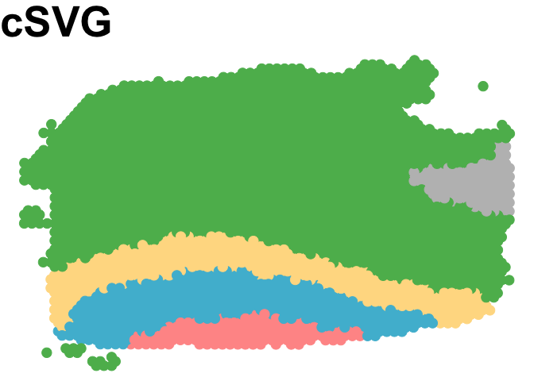

DLPFC data analysis
================

## Code for creating gene clusters

``` r
#The results from step 1 and step 2 of cSVG are already saved in the dataset folder. Use them to Look at the results and generate gene clusters
i=6 # use sample 6 as an example
data=read.csv(paste0("dataset/Results/Sample_",i,"_result_step1.csv"),row.name=1)
print(dim(data))
```

    ## [1] 4865   12

``` r
p_adj1=p.adjust(data[,12], method = "BY")
SE_genes=data[which(p_adj1<0.05),1]
print(length(SE_genes))
```

    ## [1] 2474

``` r
data=read.csv(paste0("dataset/Results/Sample_",i,"_result_step2.csv"),row.name=1)
print(dim(data))
```

    ## [1] 2474   12

``` r
p_adj2=p.adjust(data[,12], method = "BY")
a2=which(p_adj2<0.05) 
DEC_genes=data[which(p_adj2<0.05),1] 
print(length(DEC_genes))
```

    ## [1] 1247

``` r
list1=read.csv(paste0("dataset/Results/Sample_",i,"_result_step2_list1.csv"),row.name=1)
print(dim(list1))
```

    ## [1] 2474    2

``` r
source("gene_cluster.R")
out1=fn_cluster_genes(SE_genes,list1,DEC_genes)
print(table(out1))
```

    ## out1
    ##    1    2    3    4    5    6    7    8    9   10   11   12   13   14   15   16 
    ## 1510  586  179    1    1    1    1    1    1    1    1    1    1    1    1    1 
    ##   17   18   19   20   21   22   23   24   25   26   27   28   29   30   31   32 
    ##    1    1    1    1    1    1    1    1    1    1    1    1    1    1    1    1 
    ##   33   34   35   36   37   38   39   40   41   42   43   44   45   46   47   48 
    ##    1    1    1    1    1    1    1    1    1    1    1    1    1    1    1    1 
    ##   49   50   51   52   53   54   55   56   57   58   59   60   61   62   63   64 
    ##    1    1    1    1    1    1    1    1    1    1    1    1    1    1    1    1 
    ##   65   66   67   68   69   70   71   72   73   74   75   76   77   78   79   80 
    ##    1    1    1    1    1    1    1    1    1    1    1    1    1    1    1    1 
    ##   81   82   83   84   85   86   87   88   89   90   91   92   93   94   95   96 
    ##    1    1    1    1    1    1    1    1    1    1    1    1    1    1    1    1 
    ##   97   98   99  100  101  102  103  104  105  106  107  108  109  110  111  112 
    ##    1    1    1    1    1    1    1    1    1    1    1    1    1    1    1    1 
    ##  113  114  115  116  117  118  119  120  121  122  123  124  125  126  127  128 
    ##    1    1    1    1    1    1    1    1    1    1    1    1    1    1    1    1 
    ##  129  130  131  132  133  134  135  136  137  138  139  140  141  142  143  144 
    ##    1    1    1    1    1    1    1    1    1    1    1    1    1    1    1    1 
    ##  145  146  147  148  149  150  151  152  153  154  155  156  157  158  159  160 
    ##    1    1    1    1    1    1    1    1    1    1    1    1    1    1    1    1 
    ##  161  162  163  164  165  166  167  168  169  170  171  172  173  174  175  176 
    ##    1    1    1    1    1    1    1    1    1    1    1    1    1    1    1    1 
    ##  177  178  179  180  181  182  183  184  185  186  187  188  189  190  191  192 
    ##    1    1    1    1    1    1    1    1    1    1    1    1    1    1    1    1 
    ##  193  194  195  196  197  198  199  200  201  202 
    ##    1    1    1    1    1    1    1    1    1    1

``` r
write.csv(out1,paste0("dataset/LIBD_clusterlist_sample",i,".csv"))
```

## Code for creating cluster specific SpatialPCs

``` r
i=6 # use sample 6 as an example
load(paste0("dataset/LIBD_sample",i,".RData") ) 

library(SpatialPCA)

xy_coords = as.matrix(xy_coords)
rownames(xy_coords) = colnames(count_sub)
genes=rownames(count_sub)

res=read.csv(paste0("dataset/LIBD_clusterlist_sample",i,".csv"))
table(res[,2])
```

    ## 
    ##    1    2    3    4    5    6    7    8    9   10   11   12   13   14   15   16 
    ## 1510  586  179    1    1    1    1    1    1    1    1    1    1    1    1    1 
    ##   17   18   19   20   21   22   23   24   25   26   27   28   29   30   31   32 
    ##    1    1    1    1    1    1    1    1    1    1    1    1    1    1    1    1 
    ##   33   34   35   36   37   38   39   40   41   42   43   44   45   46   47   48 
    ##    1    1    1    1    1    1    1    1    1    1    1    1    1    1    1    1 
    ##   49   50   51   52   53   54   55   56   57   58   59   60   61   62   63   64 
    ##    1    1    1    1    1    1    1    1    1    1    1    1    1    1    1    1 
    ##   65   66   67   68   69   70   71   72   73   74   75   76   77   78   79   80 
    ##    1    1    1    1    1    1    1    1    1    1    1    1    1    1    1    1 
    ##   81   82   83   84   85   86   87   88   89   90   91   92   93   94   95   96 
    ##    1    1    1    1    1    1    1    1    1    1    1    1    1    1    1    1 
    ##   97   98   99  100  101  102  103  104  105  106  107  108  109  110  111  112 
    ##    1    1    1    1    1    1    1    1    1    1    1    1    1    1    1    1 
    ##  113  114  115  116  117  118  119  120  121  122  123  124  125  126  127  128 
    ##    1    1    1    1    1    1    1    1    1    1    1    1    1    1    1    1 
    ##  129  130  131  132  133  134  135  136  137  138  139  140  141  142  143  144 
    ##    1    1    1    1    1    1    1    1    1    1    1    1    1    1    1    1 
    ##  145  146  147  148  149  150  151  152  153  154  155  156  157  158  159  160 
    ##    1    1    1    1    1    1    1    1    1    1    1    1    1    1    1    1 
    ##  161  162  163  164  165  166  167  168  169  170  171  172  173  174  175  176 
    ##    1    1    1    1    1    1    1    1    1    1    1    1    1    1    1    1 
    ##  177  178  179  180  181  182  183  184  185  186  187  188  189  190  191  192 
    ##    1    1    1    1    1    1    1    1    1    1    1    1    1    1    1    1 
    ##  193  194  195  196  197  198  199  200  201  202 
    ##    1    1    1    1    1    1    1    1    1    1

``` r
g_name1=res[which(res[,2]==1),1] 
g_name2=res[which(res[,2]==2),1] 
g_name3=res[which(res[,2]==3),1] 
g_name_oth=res[which(res[,2] %in% 4:202),1] 


g_name=g_name1
LIBD = CreateSpatialPCAObject(counts=count_sub, location=xy_coords, project = "SpatialPCA",gene.type="spatial",sparkversion="sparkx",numCores_spark=5,gene.number=3000, customGenelist=g_name,min.loctions = 20, min.features=20)
```

    ## ## Use SCTransform function in Seurat to normalize data. 
    ## ## Custom gene list contains  1510  genes. 
    ## ## In total  1510  custom genes are matched with genes in the count matrix. 
    ## ## Use  1510  custom genes for analysis.

``` r
LIBD = SpatialPCA_buildKernel(LIBD, kerneltype="gaussian", bandwidthtype="SJ",bandwidth.set.by.user=NULL)
```

    ## ## Selected kernel type is:  gaussian  
    ## ## The bandwidth is:  0.0383717905277603  
    ## ## Calculating kernel matrix
    ## ## Finished calculating kernel matrix.

``` r
LIBD = SpatialPCA_EstimateLoading(LIBD,fast=FALSE,SpatialPCnum=20)
```

    ## [1] "Eigen decomposition on kernel matrix!"
    ## [1] "Using all eigenvectors and eigenvalues in the Kernel matrix!"

``` r
LIBD = SpatialPCA_SpatialPCs(LIBD, fast=FALSE)

# save results
SpatialPCA_result1 = list()
SpatialPCA_result1$SpatialPCs  = LIBD@SpatialPCs # extracted spatial PCs
SpatialPCA_result1$location = LIBD@location

save(SpatialPCA_result1, file = paste0("dataset/cluster_SpatialPCS_saved/sample",i,"_cl1.RData"))


g_name=g_name2
LIBD = CreateSpatialPCAObject(counts=count_sub, location=xy_coords, project = "SpatialPCA",gene.type="spatial",sparkversion="sparkx",numCores_spark=5,gene.number=3000, customGenelist=g_name,min.loctions = 20, min.features=20)
```

    ## ## Use SCTransform function in Seurat to normalize data. 
    ## ## Custom gene list contains  586  genes. 
    ## ## In total  586  custom genes are matched with genes in the count matrix. 
    ## ## Use  586  custom genes for analysis.

``` r
LIBD = SpatialPCA_buildKernel(LIBD, kerneltype="gaussian", bandwidthtype="SJ",bandwidth.set.by.user=NULL)
```

    ## ## Selected kernel type is:  gaussian  
    ## ## The bandwidth is:  0.0566220044458018  
    ## ## Calculating kernel matrix
    ## ## Finished calculating kernel matrix.

``` r
LIBD = SpatialPCA_EstimateLoading(LIBD,fast=FALSE,SpatialPCnum=20)
```

    ## [1] "Eigen decomposition on kernel matrix!"
    ## [1] "Using all eigenvectors and eigenvalues in the Kernel matrix!"

``` r
LIBD = SpatialPCA_SpatialPCs(LIBD, fast=FALSE)

# save results
SpatialPCA_result2 = list()
SpatialPCA_result2$SpatialPCs  = LIBD@SpatialPCs # extracted spatial PCs
SpatialPCA_result2$location = LIBD@location

save(SpatialPCA_result2, file = paste0("dataset/cluster_SpatialPCS_saved/sample",i,"_cl2.RData"))

g_name=g_name3
LIBD = CreateSpatialPCAObject(counts=count_sub, location=xy_coords, project = "SpatialPCA",gene.type="spatial",sparkversion="sparkx",numCores_spark=5,gene.number=3000, customGenelist=g_name,min.loctions = 20, min.features=20)
```

    ## ## Use SCTransform function in Seurat to normalize data. 
    ## ## Custom gene list contains  179  genes. 
    ## ## In total  179  custom genes are matched with genes in the count matrix. 
    ## ## Use  179  custom genes for analysis.

``` r
LIBD = SpatialPCA_buildKernel(LIBD, kerneltype="gaussian", bandwidthtype="SJ",bandwidth.set.by.user=NULL)
```

    ## ## Selected kernel type is:  gaussian  
    ## ## The bandwidth is:  0.0387139783711207  
    ## ## Calculating kernel matrix
    ## ## Finished calculating kernel matrix.

``` r
LIBD = SpatialPCA_EstimateLoading(LIBD,fast=FALSE,SpatialPCnum=20)
```

    ## [1] "Eigen decomposition on kernel matrix!"
    ## [1] "Using all eigenvectors and eigenvalues in the Kernel matrix!"

``` r
LIBD = SpatialPCA_SpatialPCs(LIBD, fast=FALSE)

# save results
SpatialPCA_result3 = list()
SpatialPCA_result3$SpatialPCs  = LIBD@SpatialPCs # extracted spatial PCs
SpatialPCA_result3$location = LIBD@location

save(SpatialPCA_result3, file = paste0("dataset/cluster_SpatialPCS_saved/sample",i,"_cl3.RData"))


g_name=g_name_oth
LIBD = CreateSpatialPCAObject(counts=count_sub, location=xy_coords, project = "SpatialPCA",gene.type="spatial",sparkversion="sparkx",numCores_spark=5,gene.number=3000, customGenelist=g_name,min.loctions = 20, min.features=20)
```

    ## ## Use SCTransform function in Seurat to normalize data. 
    ## ## Custom gene list contains  199  genes. 
    ## ## In total  199  custom genes are matched with genes in the count matrix. 
    ## ## Use  199  custom genes for analysis.

``` r
LIBD = SpatialPCA_buildKernel(LIBD, kerneltype="gaussian", bandwidthtype="SJ",bandwidth.set.by.user=NULL)
```

    ## ## Selected kernel type is:  gaussian  
    ## ## The bandwidth is:  0.0229123221042378  
    ## ## Calculating kernel matrix
    ## ## Finished calculating kernel matrix.

``` r
LIBD = SpatialPCA_EstimateLoading(LIBD,fast=FALSE,SpatialPCnum=20)
```

    ## [1] "Eigen decomposition on kernel matrix!"
    ## [1] "Using all eigenvectors and eigenvalues in the Kernel matrix!"

``` r
LIBD = SpatialPCA_SpatialPCs(LIBD, fast=FALSE)

# save results
SpatialPCA_result_oth = list()
SpatialPCA_result_oth$SpatialPCs  = LIBD@SpatialPCs # extracted spatial PCs
SpatialPCA_result_oth$location = LIBD@location

save(SpatialPCA_result_oth, file = paste0("dataset/cluster_SpatialPCS_saved/sample",i,"_cl_other.RData"))
```

## The analysis code for detecting spatial domains using saved datasets

``` r
library(SpatialPCA)
library(mclust)

i=6 
load(paste0("dataset/LIBD_sample",i,".RData") ) 
clusterNum=c(7,7,7,7,5,5,5,5,7,7,7,7)

load(paste0("dataset/cluster_SpatialPCS_saved/sample",i,"_cl1.RData"))
SP1=SpatialPCA_result1$SpatialPCs

load(paste0("dataset/cluster_SpatialPCS_saved/sample",i,"_cl2.RData"))
SP2=SpatialPCA_result2$SpatialPCs

load(paste0("dataset/cluster_SpatialPCS_saved/sample",i,"_cl3.RData"))
SP3=SpatialPCA_result3$SpatialPCs

load(paste0("dataset/cluster_SpatialPCS_saved/sample",i,"_cl_other.RData"))
SP_oth=SpatialPCA_result_oth$SpatialPCs

SP=rbind(SP1[1:5,],SP2[1:5,],SP3[1:5,],SP_oth[1:5,]) 

pred_cluster= walktrap_clustering(clusterNum[i],SP,knearest=70 ) #default used in SpatialPCA 
clusterlabel_refine=refine_cluster_10x(pred_cluster,SpatialPCA_result1$location,shape="hexagon") 
truth = KRM_manual_layers_sub$layer_guess_reordered
ind_na=which(is.na(truth))
ARI=adjustedRandIndex(clusterlabel_refine[-ind_na],truth[-ind_na]) 
print(paste0("The ARI is: ",ARI))
```

    ## [1] "The ARI is: 0.687056831266791"

``` r
PAS=fx_PAS(clusterlabel_refine,SpatialPCA_result1$location)
print(paste0("The PAS is: ",PAS))
```

    ## [1] "The PAS is: 0.00628930817610063"

``` r
cbp=c("#5CB85C" , "#4DBBD5" ,"#FF9896" ,"#FFDC91","grey" ,"#FED439", "#9C9EDE")
cbp=cbp[1:clusterNum[i]]
clusterlabel=clusterlabel_refine
plot_cluster(location=SpatialPCA_result1$location,clusterlabel,pointsize=4,text_size=40 ,title_in=paste0("cSVG"),color_in=cbp)
```

<!-- -->
