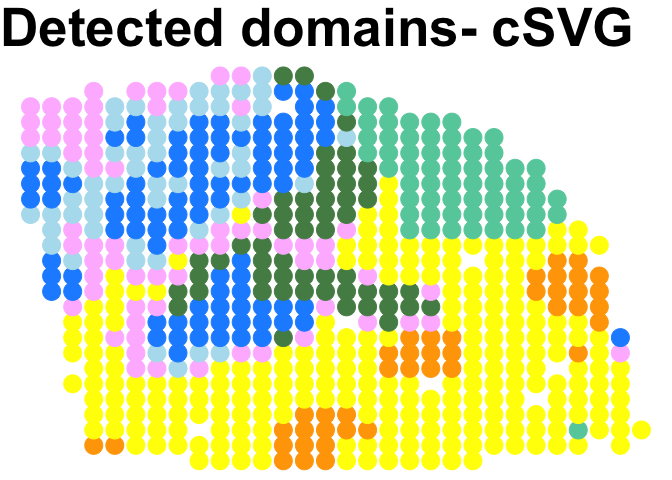

Breast Tumor data analysis
================

## The analysis code for finding SVG clusters using cSVG

### The processed data “ST_SpatialPCA_sampleH1result.RData” is downloaded from from SpatialPCA Github <https://github.com/shangll123/SpatialPCA_analysis_codes>

``` r
name = c("A1","B1","C1","D1","E1","F1","G2","H1")
kk=8
load(paste0("ST_SpatialPCA_sample",name[kk],"result.RData"))

#data_mat=SpatialPCA_result$rawcount
data_mat=SpatialPCA_result$normalized_expr
coord_df=SpatialPCA_result$location 
source("fn_main_par.R")
final1=fn_cSVG_par(data_mat=data_mat,loc_mat=coord_df,method_step1="MargcorTest",thres_step1="standard",control=FALSE,ncore=7)
```

    ## Loading required package: SKAT

    ## Loading required package: Matrix

    ## Loading required package: SPAtest

    ## Loading required package: RSpectra

    ## Loading required package: MASS

    ## [1] "dim of data matrix is:"
    ## [1] 302 607
    ## [1] "dim of coordinate matrix is:"
    ## [1] 607   2

``` r
p_adj1=p.adjust(final1[,11], method = "BY")
cSVG_SVG=which(p_adj1<0.05)
print(length(cSVG_SVG))
```

    ## [1] 268

``` r
write.csv(final1,paste0("result/result_step1_",kk,".csv"))


final1=fn_cSVG_par(data_mat=data_mat[cSVG_SVG,],loc_mat=coord_df,method_step1="MargcorTest",thres_step1="standard",control=TRUE,ncore=7)
```

    ## [1] "dim of data matrix is:"
    ## [1] 268 607
    ## [1] "dim of coordinate matrix is:"
    ## [1] 607   2

``` r
write.csv(final1$final,paste0("result/result_step2_",kk,".csv"))
list_g=final1$list_g
mat=matrix(0,nrow=length(list_g),ncol=1)
for(i in 1:length(list_g)){
    mat[i,]=paste(list_g[[i]],collapse=",")
}
write.csv(mat,paste0("result/list_step2_",kk,".csv"))
```

``` r
data11=read.csv("result/result_step1_8.csv")
p_adj=p.adjust(data11[,12], method = "BY")
SE_genes=data11[which(p_adj<0.05),1]

data21=read.csv("result/result_step2_8.csv")
p_adj=p.adjust(data21[,12], method = "BY")
DEC_genes=data21[which(p_adj<0.05),1]

list1=read.csv("result/list_step2_8.csv")

source("gene_cluster.R")
out1=fn_cluster_genes(SE_genes,list1,DEC_genes)
print(table(out1))
```

    ## out1
    ##   1   2   3   4   5   6   7   8   9  10  11  12  13  14  15  16  17  18  19 
    ##  84  48 117   3   1   1   1   1   1   1   1   1   1   1   1   1   1   1   1

``` r
write.csv(out1,"result/clusterlist_8.csv")
```

### The spatial domain detection code is given here. Followed part of the SpatialPCA analysis code to perform domain detection.

``` r
library(SpatialPCA)
library(mclust)
library(aricode)


name = c("A1","B1","C1","D1","E1","F1","G2","H1")
kk=8
load(paste0("ST_SpatialPCA_sample",name[kk],"result.RData"))

data_mat=SpatialPCA_result$rawcount
coord_df=SpatialPCA_result$location 
truth=SpatialPCA_result$annotation$label
cluster_num = length(table(truth))

res=read.csv("result/clusterlist_8.csv")
print(table(res[,2]))
```

    ## 
    ##   1   2   3   4   5   6   7   8   9  10  11  12  13  14  15  16  17  18  19 
    ##  84  48 117   3   1   1   1   1   1   1   1   1   1   1   1   1   1   1   1

``` r
g_name1=res[which(res[,2]==1),1] 
g_name2=res[which(res[,2]==2),1] 
g_name3=res[which(res[,2]==3),1] 
g_name_oth=res[which(res[,2] %in% 4:50),1] 

g_name=g_name1
LIBD = CreateSpatialPCAObject(counts=data_mat, location=coord_df, project = "SpatialPCA",gene.type="spatial",sparkversion="sparkx",numCores_spark=5,gene.number=3000, customGenelist=g_name,min.loctions = 20, min.features=20)
```

    ## ## Use SCTransform function in Seurat to normalize data. 
    ## ## Custom gene list contains  84  genes. 
    ## ## In total  84  custom genes are matched with genes in the count matrix. 
    ## ## Use  84  custom genes for analysis.

``` r
LIBD = SpatialPCA_buildKernel(LIBD, kerneltype="gaussian", bandwidthtype="SJ",bandwidth.set.by.user=NULL)
```

    ## ## Selected kernel type is:  gaussian  
    ## ## The bandwidth is:  0.0587367658409363  
    ## ## Calculating kernel matrix
    ## ## Finished calculating kernel matrix.

``` r
LIBD = SpatialPCA_EstimateLoading(LIBD,fast=FALSE,SpatialPCnum=5)
```

    ## [1] "Eigen decomposition on kernel matrix!"
    ## [1] "Using all eigenvectors and eigenvalues in the Kernel matrix!"

``` r
SP1 = SpatialPCA_SpatialPCs(LIBD, fast=FALSE)

g_name=g_name2
LIBD = CreateSpatialPCAObject(counts=data_mat, location=coord_df, project = "SpatialPCA",gene.type="spatial",sparkversion="sparkx",numCores_spark=5,gene.number=3000, customGenelist=g_name,min.loctions = 20, min.features=20)
```

    ## ## Use SCTransform function in Seurat to normalize data. 
    ## ## Custom gene list contains  48  genes. 
    ## ## In total  48  custom genes are matched with genes in the count matrix. 
    ## ## Use  48  custom genes for analysis.

``` r
LIBD = SpatialPCA_buildKernel(LIBD, kerneltype="gaussian", bandwidthtype="SJ",bandwidth.set.by.user=NULL)
```

    ## ## Selected kernel type is:  gaussian  
    ## ## The bandwidth is:  0.0644371909296375  
    ## ## Calculating kernel matrix
    ## ## Finished calculating kernel matrix.

``` r
LIBD = SpatialPCA_EstimateLoading(LIBD,fast=FALSE,SpatialPCnum=5)
```

    ## [1] "Eigen decomposition on kernel matrix!"
    ## [1] "Using all eigenvectors and eigenvalues in the Kernel matrix!"

``` r
SP2 = SpatialPCA_SpatialPCs(LIBD, fast=FALSE)

g_name=g_name3
LIBD = CreateSpatialPCAObject(counts=data_mat, location=coord_df, project = "SpatialPCA",gene.type="spatial",sparkversion="sparkx",numCores_spark=5,gene.number=3000, customGenelist=g_name,min.loctions = 20, min.features=20)
```

    ## ## Use SCTransform function in Seurat to normalize data. 
    ## ## Custom gene list contains  117  genes. 
    ## ## In total  117  custom genes are matched with genes in the count matrix. 
    ## ## Use  117  custom genes for analysis.

``` r
LIBD = SpatialPCA_buildKernel(LIBD, kerneltype="gaussian", bandwidthtype="SJ",bandwidth.set.by.user=NULL)
```

    ## ## Selected kernel type is:  gaussian  
    ## ## The bandwidth is:  0.0507608424417737  
    ## ## Calculating kernel matrix
    ## ## Finished calculating kernel matrix.

``` r
LIBD = SpatialPCA_EstimateLoading(LIBD,fast=FALSE,SpatialPCnum=5)
```

    ## [1] "Eigen decomposition on kernel matrix!"
    ## [1] "Using all eigenvectors and eigenvalues in the Kernel matrix!"

``` r
SP3 = SpatialPCA_SpatialPCs(LIBD, fast=FALSE)

g_name=g_name_oth
LIBD = CreateSpatialPCAObject(counts=data_mat, location=coord_df, project = "SpatialPCA",gene.type="spatial",sparkversion="sparkx",numCores_spark=5,gene.number=3000, customGenelist=g_name,min.loctions = 20, min.features=20)
```

    ## ## Use SCTransform function in Seurat to normalize data. 
    ## ## Custom gene list contains  18  genes. 
    ## ## In total  18  custom genes are matched with genes in the count matrix. 
    ## ## Use  18  custom genes for analysis.

``` r
LIBD = SpatialPCA_buildKernel(LIBD, kerneltype="gaussian", bandwidthtype="SJ",bandwidth.set.by.user=NULL)
```

    ## ## Selected kernel type is:  gaussian  
    ## ## The bandwidth is:  0.104421336718735  
    ## ## Calculating kernel matrix
    ## ## Finished calculating kernel matrix.

``` r
LIBD = SpatialPCA_EstimateLoading(LIBD,fast=FALSE,SpatialPCnum=5)
```

    ## [1] "Eigen decomposition on kernel matrix!"
    ## [1] "Using all eigenvectors and eigenvalues in the Kernel matrix!"

``` r
SP4 = SpatialPCA_SpatialPCs(LIBD, fast=FALSE)

SP1=SP1@SpatialPCs
SP2=SP2@SpatialPCs
SP3=SP3@SpatialPCs
SP4=SP4@SpatialPCs
SP=rbind(SP1[1:5,],SP2[1:5,],SP3[1:5,],SP4[1:5,])

pred_cluster= walktrap_clustering(cluster_num, SP,25)
clusterlabel_refine= pred_cluster
ind_na = which(SpatialPCA_result$annotation$label=="undetermined")
tabb = na.omit(data.frame("Truth"=truth[-ind_na],"clusterlabel"=clusterlabel_refine[-ind_na]))
ARI1=adjustedRandIndex(tabb[,1], tabb[,2]) 
NMI1=NMI(tabb[,1], tabb[,2])

print(paste0("The ARI is: ", ARI1))
```

    ## [1] "The ARI is: 0.482846271758821"

``` r
print(paste0("The NMI is: ", NMI1))
```

    ## [1] "The NMI is: 0.543728044893872"

``` r
cbp=c("yellow","palegreen4" ,"mediumaquamarine","dodgerblue","plum1","orange","lightblue2")
plot_cluster(location=coord_df,clusterlabel_refine,pointsize=6,text_size=40 ,title_in=paste0("Detected domains- cSVG"),color_in=cbp)
```

<!-- -->
